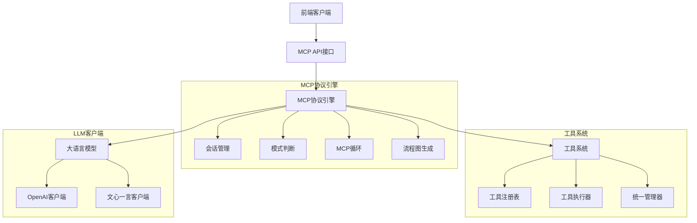
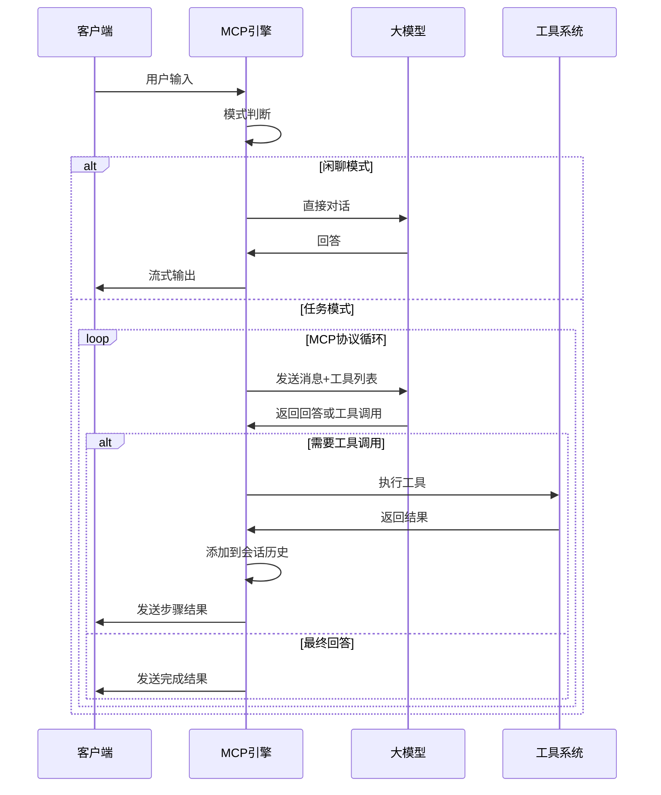

# MCP AutoGen 2.0 - 架构文档

## 🏗️ 系统架构概述

MCP AutoGen 2.0 是基于 **MCP（Model Context Protocol）** 协议重构的智能工具调用系统，实现了真正符合行业标准的大模型工具调用流程。

### 📊 架构图



## 🔄 核心改进

### 1. **标准MCP协议实现**

**原架构问题**：
- 大模型只做一次任务拆解
- 直接执行pipeline，无法动态调整
- 缺乏标准的工具调用协议

**新架构解决方案**：
- 实现标准MCP协议循环
- 大模型持续控制执行流程
- 每次工具调用后都交回控制权给大模型
- 支持动态决策和错误恢复

### 2. **MCP协议流程**



## 🛠️ 核心模块详解

### 1. MCP协议引擎 (`core/mcp_protocol_engine.py`)

**职责**：
- 实现标准MCP协议对话流程
- 管理会话状态和消息历史
- 控制LLM与工具系统的交互
- 生成实时Mermaid流程图

**核心方法**：
```python
async def execute_conversation(user_input: str, session_id: str = None) -> AsyncGenerator[Dict[str, Any], None]:
    """执行MCP对话流程 - 流式输出"""
    # 1. 模式判断
    # 2. 闲聊模式 -> 直接LLM对话
    # 3. 任务模式 -> MCP协议循环
    #    - 调用LLM
    #    - 检查工具调用
    #    - 执行工具
    #    - 更新会话历史
    #    - 继续循环或结束
```

### 2. 增强的LLM客户端

#### OpenAI客户端 (`core/llm_clients/openai_client.py`)
- 支持原生工具调用API
- 流式响应处理
- 完整的工具调用解析

#### 文心一言客户端 (`core/llm_clients/ernie_client.py`)
- 通过提示工程模拟工具调用
- 智能解析工具调用JSON
- 兼容MCP协议格式

### 3. 新MCP API接口 (`api/mcp_api.py`)

**特性**：
- RESTful API + WebSocket双支持
- 标准MCP协议消息格式
- 内置演示页面
- 会话管理和历史查询

**端点**：
```
GET  /                    # API信息
GET  /health              # 健康检查
GET  /tools               # 获取可用工具
GET  /demo                # 演示页面
WS   /ws/mcp/chat         # MCP协议WebSocket
WS   /ws/mcp/stream       # 流式WebSocket
```

### 4. 前端MCP适配 (`frontend/mcp_chat/`)

**更新内容**：
- 新的WebSocket消息处理器
- MCP协议消息类型支持
- 实时Mermaid图表渲染
- 模式自动切换UI

## 🔧 消息协议定义

### WebSocket消息格式

#### 客户端发送
```json
{
  "user_input": "用户输入内容",
  "session_id": "可选的会话ID"
}
```

#### 服务端响应

**模式检测**：
```json
{
  "type": "mode_detection",
  "mode": "chat|task",
  "session_id": "会话ID",
  "message": "检测结果描述"
}
```

**闲聊响应**：
```json
{
  "type": "chat_response",
  "session_id": "会话ID",
  "message": "LLM回答内容",
  "execution_time": 1.23
}
```

**任务开始**：
```json
{
  "type": "task_start",
  "session_id": "会话ID",
  "message": "任务开始描述",
  "mermaid_diagram": "graph LR..."
}
```

**工具执行结果**：
```json
{
  "type": "tool_result",
  "session_id": "会话ID",
  "step": {
    "step_id": "工具调用ID",
    "tool_name": "工具名称",
    "input_params": {...},
    "output": {...},
    "execution_time": 0.5,
    "status": "success|error"
  },
  "mermaid_diagram": "更新的流程图"
}
```

**任务完成**：
```json
{
  "type": "task_complete",
  "session_id": "会话ID",
  "message": "最终结果",
  "execution_time": 5.67,
  "mermaid_diagram": "完整流程图",
  "steps": [...]
}
```

## 🚀 部署和使用

### 1. 启动MCP API服务
```bash
# 使用新的启动脚本
python start_mcp_api.py

# 或直接运行
cd api && python mcp_api.py
```

### 2. 访问演示页面
```
http://localhost:8001/demo
```

### 3. API测试
```bash
# 获取工具列表
curl http://localhost:8001/tools

# 健康检查
curl http://localhost:8001/health
```

### 4. WebSocket测试
```javascript
const ws = new WebSocket('ws://localhost:8001/ws/mcp/chat');
ws.onopen = () => {
  ws.send(JSON.stringify({
    user_input: "帮我搜索一下北京天气",
    session_id: null
  }));
};
```

## 🎯 核心优势

### 1. **标准化协议**
- 符合MCP行业标准
- 可与其他MCP兼容系统集成
- 标准化的消息格式和流程

### 2. **智能控制流程**
- 大模型持续控制执行
- 动态决策和路径调整
- 自动错误检测和恢复

### 3. **实时可视化**
- 动态更新的Mermaid流程图
- 实时执行状态显示
- 清晰的步骤追踪

### 4. **多模型支持**
- OpenAI GPT系列
- 百度文心一言
- 易于扩展其他模型

### 5. **高性能架构**
- 异步处理
- 流式响应
- 会话管理和缓存

## 🔄 迁移指南

### 从旧版本迁移

1. **API端点更新**：
   ```
   旧: ws://localhost:8000/ws/execute_task
   新: ws://localhost:8001/ws/mcp/chat
   ```

2. **消息格式更新**：
   - 使用新的MCP协议消息格式
   - 更新前端WebSocket处理器

3. **配置更新**：
   ```bash
   # 更新环境变量
   PORT=8001
   OPENAI_API_KEY=your_key
   ```

## 📈 性能优化

### 1. **并发处理**
- 异步工具执行
- 并行会话管理
- 非阻塞I/O操作

### 2. **缓存策略**
- LLM响应缓存
- 工具结果缓存
- 会话状态缓存

### 3. **资源管理**
- 连接池管理
- 内存使用优化
- 超时控制

## 🛡️ 安全考虑

### 1. **输入验证**
- 用户输入过滤
- JSON格式验证
- 参数类型检查

### 2. **访问控制**
- 会话隔离
- 工具权限管理
- API限流

### 3. **错误处理**
- 异常捕获和记录
- 优雅降级
- 错误信息脱敏

## 🔮 未来规划

### 1. **协议扩展**
- 支持更多MCP标准特性
- 自定义协议扩展
- 插件系统

### 2. **模型集成**
- 更多LLM提供商支持
- 本地模型集成
- 模型路由和负载均衡

### 3. **工具生态**
- 工具市场
- 社区贡献工具
- 工具版本管理

---

## 📞 技术支持

如有问题或建议，请：
1. 查看演示页面：`http://localhost:8001/demo`
2. 检查日志输出
3. 参考API文档：`http://localhost:8001/docs`

**MCP AutoGen 2.0 - 让AI工具调用更智能、更标准！** 🚀 