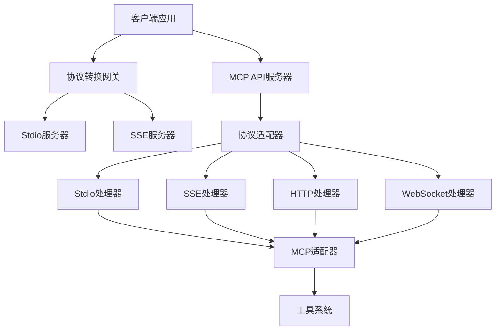

# MCP双协议支持使用指南

## 🌟 概述

MCP AutoGen 2.0 现已支持四种传输协议，提供灵活的部署和集成选项：

- **HTTP POST** - 标准的RESTful API
- **WebSocket** - 实时双向通信
- **SSE (Server-Sent Events)** - 流式响应，适合实时推送
- **Stdio** - 标准输入输出，适合CLI工具和进程间通信

## 🏗️ 架构图



## 🚀 快速开始

### 1. Stdio服务器

最简单的MCP服务器形式，通过stdin/stdout进行通信：

```bash
# 启动stdio服务器
python mcp_stdio_server.py

# 发送请求（JSON格式）
echo '{"mcp_version":"1.0","session_id":"test","request_id":"1","user_query":"搜索Python教程"}' | python mcp_stdio_server.py
```

### 2. SSE服务器

启动支持SSE的HTTP服务器：

```bash
# 启动主API服务器（包含SSE支持）
python -m uvicorn api.mcp_standard_api:app --host 0.0.0.0 --port 8000

# 访问SSE演示页面
open http://localhost:8000/mcp/sse/demo
```

### 3. 协议转换网关

在不同协议间进行转换：

```bash
# 将stdio服务转换为SSE端点
python mcp_protocol_gateway.py --stdio "python mcp_stdio_server.py" --port 8001

# 将SSE服务转换为stdio接口
python mcp_protocol_gateway.py --sse "http://localhost:8000/mcp/sse" --mode stdio
```

## 📝 详细使用说明

### Stdio服务器

#### 启动参数

```bash
python mcp_stdio_server.py [OPTIONS]

选项:
  --config, -c TEXT       配置文件路径
  --log-level, -l TEXT    日志级别 [DEBUG|INFO|WARNING|ERROR]
  --log-file TEXT         日志文件路径
  --version, -v           显示版本信息
  --help                  显示帮助信息
```

#### 请求格式

```json
{
  "mcp_version": "1.0",
  "session_id": "session_123",
  "request_id": "req_456",
  "user_query": "用户查询内容",
  "context": {
    "additional": "context_data"
  }
}
```

#### 响应格式

```json
{
  "mcp_version": "1.0",
  "session_id": "session_123",
  "request_id": "req_456",
  "status": "success",
  "steps": [...],
  "final_response": "最终回答",
  "execution_time": 2.5,
  "timestamp": "2024-01-01T12:00:00Z"
}
```

#### 使用示例

```bash
# 1. 启动stdio服务器
python mcp_stdio_server.py --log-level DEBUG

# 2. 在另一个终端中发送请求
echo '{"mcp_version":"1.0","user_query":"搜索人工智能相关信息"}' | nc localhost 8000

# 3. 或者使用Python脚本
cat << EOF | python mcp_stdio_server.py
{"mcp_version":"1.0","session_id":"test","user_query":"生成一个图片"}
EOF
```

### SSE服务器

#### API端点

- `POST /mcp/sse` - SSE端点，接收请求并返回流式响应
- `GET /mcp/sse/demo` - SSE演示页面
- `GET /protocol/stats` - 协议统计信息
- `GET /protocol/connections` - 活跃连接信息

#### 客户端示例 (JavaScript)

```javascript
// 发送SSE请求
const requestData = {
    mcp_version: "1.0",
    session_id: "demo_session",
    user_query: "帮我搜索Python相关资料",
    context: {}
};

fetch('/mcp/sse', {
    method: 'POST',
    headers: {
        'Content-Type': 'application/json',
        'Accept': 'text/event-stream'
    },
    body: JSON.stringify(requestData)
})
.then(response => response.body)
.then(body => {
    const reader = body.getReader();
    
    function readStream() {
        reader.read().then(({ done, value }) => {
            if (done) {
                console.log('SSE stream completed');
                return;
            }
            
            const text = new TextDecoder().decode(value);
            const lines = text.split('\n');
            
            lines.forEach(line => {
                if (line.startsWith('data: ')) {
                    const data = JSON.parse(line.substring(6));
                    console.log('SSE Event:', data);
                }
            });
            
            readStream();
        });
    }
    
    readStream();
});
```

#### 客户端示例 (Python)

```python
import aiohttp
import asyncio
import json

async def sse_client():
    request_data = {
        "mcp_version": "1.0",
        "session_id": "python_client",
        "user_query": "搜索机器学习教程",
        "context": {}
    }
    
    async with aiohttp.ClientSession() as session:
        async with session.post(
            'http://localhost:8000/mcp/sse',
            json=request_data,
            headers={'Accept': 'text/event-stream'}
        ) as response:
            async for line in response.content:
                line_str = line.decode('utf-8').strip()
                if line_str.startswith('data: '):
                    event_data = json.loads(line_str[6:])
                    print(f"Event: {event_data}")

# 运行客户端
asyncio.run(sse_client())
```

### 协议转换网关

#### 使用场景

1. **将本地stdio服务暴露为Web SSE服务**
   ```bash
   python mcp_protocol_gateway.py --stdio "python mcp_stdio_server.py" --port 8001
   # 访问: http://localhost:8001/sse
   ```

2. **将远程SSE服务转换为本地stdio接口**
   ```bash
   python mcp_protocol_gateway.py --sse "http://localhost:8000/mcp/sse" --mode stdio
   # 然后可以通过stdin/stdout与远程服务交互
   ```

3. **跨网络的协议桥接**
   ```bash
   # 在服务器A上运行stdio服务
   python mcp_stdio_server.py
   
   # 在服务器B上运行网关，将stdio服务暴露为SSE
   python mcp_protocol_gateway.py --stdio "ssh user@serverA python /path/to/mcp_stdio_server.py" --port 8002
   ```

#### 网关配置示例

```bash
# 基本用法
python mcp_protocol_gateway.py --stdio "python mcp_stdio_server.py" --port 8000

# 高级配置
python mcp_protocol_gateway.py \
  --stdio "python mcp_stdio_server.py --config production.json" \
  --port 8000 \
  --host 0.0.0.0 \
  --log-level DEBUG
```

## ⚙️ 配置文件

### stdio服务器配置 (config.json)

```json
{
  "llm": {
    "type": "openai",
    "model": "gpt-4-turbo",
    "api_key": "${OPENAI_API_KEY}",
    "base_url": "https://api.openai.com/v1"
  },
  "tool_registry": {
    "auto_discover": true,
    "tool_paths": ["./tools"]
  },
  "server": {
    "max_sessions": 1000,
    "execution_timeout": 300,
    "max_iterations": 10
  }
}
```

## 🔍 协议对比

| 特性 | HTTP POST | WebSocket | SSE | Stdio |
|------|-----------|-----------|-----|-------|
| 连接类型 | 请求-响应 | 双向实时 | 单向流式 | 进程通信 |
| 部署复杂度 | 低 | 中 | 低 | 极低 |
| 实时性 | 一般 | 高 | 高 | 高 |
| 资源消耗 | 低 | 中 | 低 | 极低 |
| 适用场景 | API调用 | 实时交互 | 流式推送 | CLI工具 |
| 网络要求 | HTTP | WebSocket | HTTP | 无 |

## 🛠️ 故障排除

### 常见问题

1. **Stdio服务器无响应**
   ```bash
   # 检查进程状态
   ps aux | grep mcp_stdio_server
   
   # 检查日志
   python mcp_stdio_server.py --log-level DEBUG --log-file debug.log
   ```

2. **SSE连接断开**
   - 检查网络连接
   - 确认防火墙设置
   - 验证客户端Accept头设置为`text/event-stream`

3. **网关转换失败**
   ```bash
   # 检查目标服务状态
   curl -v http://localhost:8000/health
   
   # 检查stdio命令是否正确
   echo '{"test":"data"}' | python mcp_stdio_server.py
   ```

### 性能优化

1. **Stdio模式**
   - 使用无缓冲I/O
   - 避免大量并发连接
   - 考虑使用连接池

2. **SSE模式**
   - 启用HTTP/2
   - 设置合适的心跳间隔
   - 使用CDN加速

3. **网关模式**
   - 设置合适的超时时间
   - 使用连接复用
   - 监控内存使用

## 📊 监控和日志

### 协议统计信息

```bash
# 获取协议统计
curl http://localhost:8000/protocol/stats

# 响应示例
{
  "status": "success",
  "data": {
    "sse_connections": 3,
    "stdio_running": true,
    "supported_protocols": ["stdio", "sse", "http", "websocket"]
  }
}
```

### 活跃连接监控

```bash
# 获取活跃连接
curl http://localhost:8000/protocol/connections

# 响应示例
{
  "status": "success",
  "data": {
    "sse_connections": ["session_1", "session_2"],
    "total_connections": 2
  }
}
```

## 🔐 安全考虑

1. **Stdio模式**
   - 验证输入JSON格式
   - 限制命令执行权限
   - 使用安全的工作目录

2. **SSE模式**
   - 启用CORS保护
   - 验证请求来源
   - 限制连接数量

3. **网关模式**
   - 验证upstream服务
   - 设置访问控制
   - 记录审计日志

## 📚 扩展开发

### 自定义传输协议

```python
from core.protocol_adapter import BaseTransportHandler, ProtocolContext

class CustomTransportHandler(BaseTransportHandler):
    async def handle_request(self, request, context):
        # 自定义请求处理逻辑
        return await self.mcp_adapter.handle_request(request)
    
    async def send_response(self, response, context):
        # 自定义响应发送逻辑
        pass
```

### 集成第三方系统

```python
# 与现有系统集成
from core.protocol_adapter import ProtocolAdapter

# 创建适配器
adapter = ProtocolAdapter()

# 处理来自第三方系统的请求
request = {"user_query": "来自外部系统的请求"}
response = await adapter.handle_stdio_request(request)
```

---

通过以上配置，你的MCP系统现在支持四种传输协议，可以灵活适应各种部署环境和集成需求。无论是简单的CLI工具还是复杂的Web应用，都能找到合适的通信方式。 